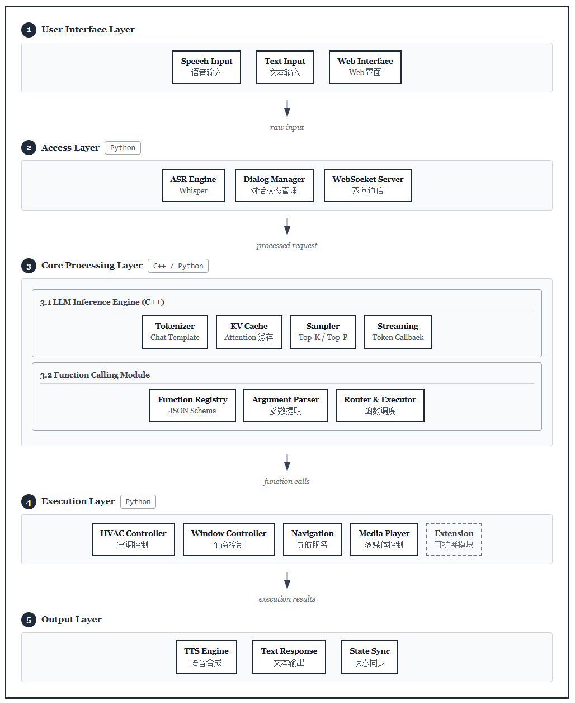

# Intelligent Cockpit Voice Assistant - FRIDAY / Cockpit Assistant - FRIDAY

Intelligent cockpit assistant based on Large Language Models, supporting voice interaction and vehicle simulation control.

## Features

- 🎙️ **Voice Interaction**: Integrated with Whisper ASR and Edge TTS
- 🚗 **Vehicle Control**: Function Calling for AC, windows, navigation, music, etc.
- 💬 **Multi-turn Dialogue**: Continuous conversation with context memory
- ⚡ **Streaming Output**: Low-latency streaming text generation
- 🔧 **High-Performance Inference**: C++ inference engine + Python business layer

## System Architecture



## Requirements

- Ubuntu 20.04+ / macOS 12+
- Python 3.10+
- CMake 3.18+
- CUDA 11.8+ (optional, for GPU acceleration)
- GCC 11+ / Clang 14+

## Quick Start

### 1. Clone the Project and Install Dependencies

```bash
# Clone the project
git clone https://github.com/MarriotZ/Cockpit-Assistant-Friday
cd cockpit-assistant-friday

# Install Python dependencies
pip install -r requirements.txt

# Download and compile llama.cpp
./scripts/setup_llama_cpp.sh
```

### 2. Download Models

```bash
# Recommended 3B model for best experience (full functionality, compatible with various devices)
./scripts/download_model.sh qwen2.5-3b
```

<del>
# Compatible with multiple models, can further use QWen3-4B, but need to enable (or disable thinking mode) to filter <think></think> tags
Qwen2.5-7B-Instruct model
./scripts/download_model.sh qwen2.5-7b

# Or use the smaller 3B model (suitable for low-end devices)
./scripts/download_model.sh qwen2.5-3b

</del>

### 3. Compile C++ Inference Engine

```bash
mkdir build && cd build
cmake .. -DGGML_CUDA=ON  # Use GPU acceleration
# cmake .. -DGGML_CUDA=OFF  # CPU only
make -j$(nproc)
cd ..
```

### 4. Run Demos

```bash
# Text interaction mode
python python/demo_text.py

# Voice interaction mode
python python/demo_voice.py

# Web interface mode
python python/demo_web.py
```

## Project Structure

```
cockpit-assistant/
├── CMakeLists.txt              # CMake build configuration
├── README.md                   # Project documentation
├── requirements.txt            # Python dependencies
├── cpp/                        # C++ code
│   ├── include/                # Header files
│   │   ├── inference_engine.h  # Inference engine interface
│   │   ├── kv_cache.h          # KV cache management
│   │   ├── sampler.h           # Sampling strategy
│   │   └── tokenizer.h         # Tokenizer
│   ├── src/                    # Source files
│   │   ├── inference_engine.cpp
│   │   ├── kv_cache.cpp
│   │   ├── sampler.cpp
│   │   └── tokenizer.cpp
│   └── bindings/               # Python bindings
│       └── pybind_engine.cpp
├── python/                     # Python code
│   ├── __init__.py
│   ├── cockpit_assistant.py    # Main cockpit assistant class
│   ├── vehicle_controller.py   # Vehicle controller
│   ├── function_registry.py    # Function registry
│   ├── voice_interface.py      # Voice interface
│   ├── demo_text.py            # Text demo
│   ├── demo_voice.py           # Voice demo
│   └── demo_web.py             # Web demo
├── models/                     # Model storage directory
├── config/                     # Configuration files
│   └── config.yaml
├── tests/                      # Tests
│   ├── test_engine.cpp
│   └── test_assistant.py
└── scripts/                    # Scripts
    ├── setup_llama_cpp.sh
    └── download_model.sh
```

## Configuration

Edit `config/config.yaml` to customize settings:

```yaml
model:
  path: "models/qwen2.5-7b-instruct-q4_k_m.gguf"
  n_ctx: 4096
  n_gpu_layers: 35
  
inference:
  temperature: 0.7
  max_tokens: 512
  top_p: 0.9
  
voice:
  asr_model: "small"
  tts_voice: "en-US-AvaNeural"
  wake_word: "Hey Friday"
```

## API Usage Examples

### Python API

```python
from cockpit_assistant import CockpitAssistant

# Initialize assistant
assistant = CockpitAssistant("models/qwen2.5-7b-instruct-q4_k_m.gguf")

# Text conversation
async for token in assistant.chat("Turn on the AC and set temperature to 26 degrees"):
    print(token, end="", flush=True)
```

### Usage with Voice

```python
from voice_interface import CockpitVoiceAssistant

assistant = CockpitVoiceAssistant("models/qwen2.5-7b-instruct-q4_k_m.gguf")

# Process voice input
async for audio_chunk in assistant.process_voice_input(audio_data):
    play_audio(audio_chunk)
```

## Function Calling

The system supports the following vehicle control functions:

| Function Name | Description | Parameters |
|---------------|-------------|------------|
| `control_air_conditioner` | Control AC | action, temperature, fan_speed |
| `control_window` | Control windows | position, action |
| `navigate_to` | Set navigation | destination, via_points |
| `play_music` | Play music | query, action |
| `get_vehicle_status` | Query vehicle status | info_type |
| `control_lights` | Control lights | light_type, action |
| `make_phone_call` | Make phone call | contact |

## Performance Metrics
To be re-tested, code has been optimized

<del>

On NVIDIA RTX 4090 with Qwen2.5-7B-Instruct-Q4_K_M:

| Metric | Value |
|--------|-------|
| First Token Latency | ~150ms |
| Generation Speed | ~45 tokens/s |
| Memory Usage | ~6GB |
| ASR Latency | ~200ms |

</del>

## Extension Development

### Adding New Control Functions

1. Define function schema in `python/function_registry.py`
2. Implement processing logic in `python/vehicle_controller.py`
3. Update system prompt

### Adapting to New Hardware

Modify compilation options in `CMakeLists.txt` to adapt to different hardware:

- NVIDIA Jetson: `-DGGML_CUDA=ON`
- Apple Silicon: `-DGGML_METAL=ON`
- Qualcomm Platform: Requires QNN backend

## Work in Progress
### Mobile Device Remote Control

**Currently developing iOS and Android solutions for remote control of this assistant**

## License

MIT License

## Acknowledgments
- [llama.cpp](https://github.com/ggml-org/llama.cpp)
- [Qwen](https://github.com/QwenLM/Qwen)
- [faster-whisper](https://github.com/SYSTRAN/faster-whisper)
- [edge-tts](https://github.com/rany2/edge-tts)
